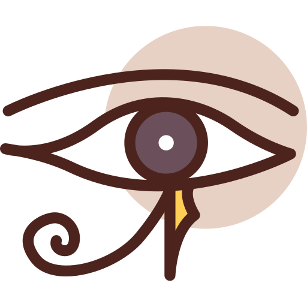

#  Horus ([H] orus [O] bfuscate [R] emote [U] pdate [S] ystem)

Horus is a web-based plugin installation system. It does not keep any files on the disk. You can install more than one plugin. You need to create your plugins in c#. Updates are applied when the program is restarted after making changes to the plugins on the web.

## Scenes

// will be updated.

## Scheme

// will be updated.

## Webside

// will be updated.

## Disclaimer

Damages that may occur to individuals and institutions or from the use of the software are entirely the responsibility of the person using the software.

## Contributing

Pull requests are welcome. For major changes, please open an issue first to discuss what you would like to change.

Please make sure to update tests as appropriate.

## License
[MIT](https://choosealicense.com/licenses/mit/)
